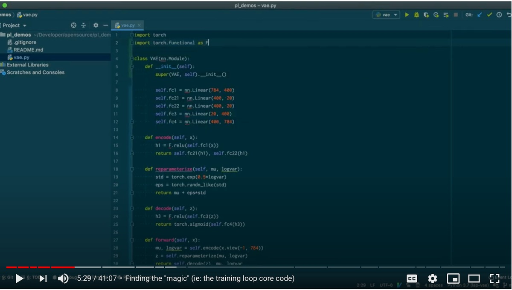
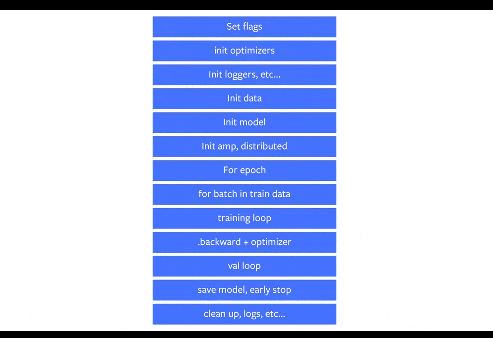

<h1 align="center">Welcome to PyTorch Lightning Template 👋</h1>

<div align="center">
  

## PyTorch Lightning
**The lightweight PyTorch wrapper for ML researchers. Scale your models. Write less boilerplate.**
</div>

<p>
  
  <a href="https://github.com/rubentea16/pl-mnist#readme" target="_blank">
    
  </a>
  <a href="#" target="_blank">
    
  </a>
  <a href="https://twitter.com/mindbelowink" target="_blank">
    
  </a>
</p>

> PyTorch Lightning template for MNIST Classification problem

### 🏠 [Homepage](https://github.com/rubentea16/pl-mnist#readme)

---  
## What do I do ?
- Add learning rate scheduler and logger
- Add custom callback class
- Add early stopping callback
- Add Model Checkpoint
- Add TensorBoard for visualisation metric
- Show how to training, validation, testing, and inference the model

## Refactoring your PyTorch code + benefits + full walk-through
[](https://www.youtube.com/watch?v=QHww1JH7IDU)

## What is it?
[READ THIS QUICK START PAGE](https://pytorch-lightning.readthedocs.io/en/stable/new-project.html)

Lightning is a way to organize your PyTorch code to decouple the science code from the engineering.
It's more of a PyTorch style-guide than a framework. 

In Lightning, you organize your code into 3 distinct categories:

1. Research code (goes in the LightningModule).
2. Engineering code (you delete, and is handled by the Trainer).
3. Non-essential research code (logging, etc... this goes in Callbacks).

Here's an example of how to refactor your research code into a [LightningModule](https://pytorch-lightning.readthedocs.io/en/latest/lightning-module.html).


The rest of the code is automated by the [Trainer](https://pytorch-lightning.readthedocs.io/en/latest/trainer.html)!


## What does lightning control for me?

Everything in Blue!
This is how lightning separates the science (red) from engineering (blue).



## Why do I want to use lightning?
Although your research/production project might start simple, once you add things like GPU AND TPU training, 16-bit precision, etc, you end up spending more time engineering than researching. Lightning automates AND rigorously tests those parts for you.

## Install

```sh
pip install pytorch-lightning
```

## Usage

```sh
pl_mnist.ipynb
```

## Author

👤 **Ruben Stefanus**

* Website: [Ruben Stefanus](https://rubentea16.github.io/)
* Twitter: [@mindbelowink](https://twitter.com/mindbelowink)
* Github: [@rubentea16](https://github.com/rubentea16)
* LinkedIn: [@rubenstefanus](https://linkedin.com/in/rubenstefanus)

## Show your support

Give a ⭐️ if this project helped you!

***
